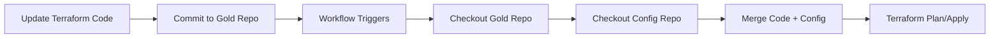

# Azure Landing Zone - Gold Repository (Terraform Code)

This is the **Gold Repository** containing standardized Terraform code, root modules, and reusable infrastructure modules for Azure Landing Zone deployments.

## 📁 Repository Structure

```
fst-azcloud-goldrepo-testing/
├── alz-platform/
│   ├── pattern1/                       # Primary landing zone pattern
│   │   ├── connectivity/               # Hub networking and connectivity
│   │   │   ├── main.tf
│   │   │   ├── variables.tf
│   │   │   ├── outputs.tf
│   │   │   └── backend.tfvars (optional)
│   │   ├── identity_dev/              # Identity and access management
│   │   ├── management/                # Management and monitoring
│   │   ├── security/                  # Security services and policies
│   │   └── sharedservices/            # Shared services infrastructure
│   └── pattern2/                      # Alternative landing zone patterns
│       ├── platform-connectivity-alz-deployment/
│       ├── platform-identity-alz-deployment/
│       ├── platform-management-alz-deployment/
│       ├── platform-security-alz-deployment/
│       └── platform-sharedservices-alz-deployment/
└── Modules Hub/
    └── terraform-modules/
        ├── module-priority.csv        # Module deployment priority matrix
        ├── AKS/                       # Azure Kubernetes Service
        ├── AKS-Nodepool/
        ├── AKSBackupPolicy/
        ├── apimanagement/             # API Management
        ├── appgateway/                # Application Gateway
        ├── applicationinsights/       # Application Insights
        ├── automationAccount/         # Automation Account
        ├── AzureContainerRegistry/    # Container Registry
        ├── azurefirewall/             # Azure Firewall
        ├── azurepolicy/               # Azure Policy
        ├── backupvault/               # Backup Vault
        ├── bastionhost/               # Bastion Host
        ├── cognitivesearch/           # Cognitive Search
        ├── cosmosdb*/                 # Cosmos DB (account, database, container)
        ├── databricksworkspace/       # Databricks Workspace
        ├── datacollection*/           # Data Collection (endpoint, rule)
        ├── datadisk*/                 # Data Disks and attachments
        ├── datafactory/               # Data Factory
        ├── ddos/                      # DDoS Protection
        ├── diagnosticlogs/            # Diagnostic Logs
        ├── diskbackuppolicy/          # Disk Backup Policy
        ├── diskencryptionset/         # Disk Encryption Set
        ├── eventhub*/                 # Event Hub and namespace
        ├── firewallPolicy/            # Firewall Policy
        ├── hub/                       # Hub networking
        ├── keyvault*/                 # Key Vault and keys
        ├── linuxvm/                   # Linux Virtual Machines
        ├── localnetworkgateway/       # Local Network Gateway
        ├── loganalytics/              # Log Analytics Workspace
        ├── machinelearning/           # Machine Learning
        ├── managementgroup/           # Management Groups
        ├── mssqlserver/               # SQL Server
        ├── mysql*/                    # MySQL (flexible server, database)
        ├── networksecuritygroup/      # Network Security Groups
        ├── networkwatcher/            # Network Watcher
        ├── nsgflowlogs/               # NSG Flow Logs
        ├── openai/                    # Azure OpenAI
        ├── peering/                   # VNet Peering
        ├── postgresql*/               # PostgreSQL (flexible, database)
        ├── privatedns*/               # Private DNS (zones, records, links)
        ├── privateendpoint/           # Private Endpoints
        ├── publicip/                  # Public IP Addresses
        ├── rbac/                      # Role-Based Access Control
        ├── recoveryservicevault/      # Recovery Services Vault
        ├── rediscache/                # Redis Cache
        ├── resourcegroup/             # Resource Groups
        ├── resourcelock/              # Resource Locks
        ├── routetable/                # Route Tables
        ├── sentinel/                  # Microsoft Sentinel
        ├── serviceplan/               # App Service Plan
        ├── sqlpaas/                   # SQL PaaS
        ├── storageaccount/            # Storage Accounts
        ├── storagebackuppolicy/       # Storage Backup Policy
        ├── subnet/                    # Subnets
        ├── subscription/              # Subscription resources
        ├── synapseworkspace/          # Synapse Workspace
        ├── updatemanager/             # Update Manager
        ├── userassignedidentity/      # User Assigned Identity
        ├── virtualnetwork/            # Virtual Networks
        ├── vmbackuppolicy/            # VM Backup Policy
        ├── vmextension/               # VM Extensions
        ├── vnetgateway/               # VNet Gateway
        ├── vnetpeering/               # VNet Peering
        ├── vpnconnections/            # VPN Connections
        ├── vpnpublicip/               # VPN Public IP
        ├── windowsvm/                 # Windows Virtual Machines
        └── windowswebapp/             # Windows Web App
```

## 🎯 Purpose

This repository serves as the **source of truth** for:
- ✅ Terraform infrastructure-as-code (IaC)
- ✅ Landing zone root module configurations
- ✅ Reusable Terraform modules (70+ modules)
- ✅ Standardized Azure resource deployments

## 🔄 Companion Repository

This repository works in tandem with:

**📦 fst-azcloud-fndtn-ptrn-testing** (Configuration Repository)
- Contains environment-specific `.tfvars` files
- Hosts GitHub Actions workflows for automated deployment
- Provides runtime configuration values

## 📂 Directory Purposes

### `alz-platform/`

Landing zone root modules organized by deployment patterns.

#### Pattern 1 - Modular Subscription Approach

Each subscription has its own Terraform root module:

| Subscription | Purpose | Key Resources |
|--------------|---------|---------------|
| **connectivity** | Hub networking, ExpressRoute, VPN, Firewall | VNet, Azure Firewall, VPN Gateway, DDoS Protection |
| **identity_dev** | Identity services and directory integration | Azure AD, Domain Controllers, RBAC |
| **management** | Monitoring, logging, governance | Log Analytics, Automation, Update Management |
| **security** | Security services and compliance | Sentinel, Security Center, Key Vault |
| **sharedservices** | Shared infrastructure services | Container Registry, Bastion, private DNS |

Each root module contains:
- `main.tf` - Main Terraform configuration
- `variables.tf` - Input variable definitions
- `outputs.tf` - Output value definitions (optional)
- `backend.tfvars` - Backend state configuration (optional)

#### Pattern 2 - Monolithic Deployment

Alternative approach with consolidated deployment packages.

### `Modules Hub/terraform-modules/`

**Reusable Terraform modules** for Azure resources. Each module follows a standardized structure:

```
module-name/
├── main.tf           # Resource definitions
├── variables.tf      # Module input variables
├── outputs.tf        # Module outputs
└── README.md         # Module documentation (optional)
```

#### Module Categories

**Compute**: `linuxvm`, `windowsvm`, `AKS`, `AKS-Nodepool`  
**Networking**: `virtualnetwork`, `subnet`, `appgateway`, `azurefirewall`, `privateendpoint`  
**Storage**: `storageaccount`, `AzureContainerRegistry`  
**Database**: `cosmosdb*`, `mssqlserver`, `mysql*`, `postgresql*`, `rediscache`  
**Security**: `keyvault`, `diskencryptionset`, `azurepolicy`, `sentinel`  
**Monitoring**: `loganalytics`, `applicationinsights`, `networkwatcher`, `diagnosticlogs`  
**Backup**: `recoveryservicevault`, `backupvault`, `*backuppolicy`  
**Analytics**: `databricksworkspace`, `synapseworkspace`, `datafactory`, `machinelearning`  
**AI/ML**: `openai`, `cognitivesearch`  
**Management**: `resourcegroup`, `managementgroup`, `rbac`, `resourcelock`, `automationAccount`

## 🏗️ Module Usage

### Example: Using a Reusable Module

In a root module (e.g., `alz-platform/pattern1/connectivity/main.tf`):

```hcl
module "hub_vnet" {
  source = "../../../Modules Hub/terraform-modules/virtualnetwork"
  
  resource_group_name = var.resource_group_name
  location            = var.location
  vnet_name          = var.hub_vnet_name
  address_space      = var.hub_address_space
  
  tags = var.tags
}

module "azure_firewall" {
  source = "../../../Modules Hub/terraform-modules/azurefirewall"
  
  resource_group_name = var.resource_group_name
  location            = var.location
  firewall_name      = var.firewall_name
  subnet_id          = module.hub_vnet.subnet_ids["AzureFirewallSubnet"]
  
  tags = var.tags
}
```

### Example: Calling from External Repository

GitHub Actions workflow automatically checks out this repo:

```yaml
- name: Checkout gold repo (terraform root)
  uses: actions/checkout@v4
  with:
    repository: Gurkirats08/fst-azcloud-goldrepo-testing
    ref: main
    path: goldrepo
```

Then references modules:

```bash
terraform plan \
  -var-file="${WORKSPACE}/ptrn/alz-platform-vars/pattern1/connectivity.tfvars"
```

## 📋 Module Priority

The `module-priority.csv` file defines deployment order for interdependent resources:

```csv
Priority,Module,Dependencies
1,resourcegroup,None
2,virtualnetwork,resourcegroup
3,subnet,virtualnetwork
4,keyvault,resourcegroup
...
```

Use this to ensure proper resource creation sequence.

## 🛠️ Development Guidelines

### Adding New Modules

1. Create module directory in `Modules Hub/terraform-modules/`
2. Follow standard structure:
   ```
   new-module/
   ├── main.tf
   ├── variables.tf
   ├── outputs.tf
   └── README.md
   ```
3. Use consistent naming conventions
4. Include comprehensive variable descriptions
5. Tag all resources with standard tags
6. Update `module-priority.csv` if applicable

### Modifying Root Modules

1. Navigate to appropriate pattern folder
2. Edit Terraform files in the subscription folder
3. Test changes locally with `terraform plan`
4. Commit to `main` branch
5. Workflow in companion repo will use latest code

### Best Practices

✅ **Use variables** for all configurable values  
✅ **Version pinning** for provider versions  
✅ **Output important values** for module consumption  
✅ **Document modules** with README files  
✅ **Consistent naming** following Azure naming conventions  
✅ **Tag resources** with environment, owner, cost center  
✅ **State management** with Azure Storage backend  
✅ **Module versioning** using Git tags (recommended)

## 🔐 State Management

### Backend Configuration

Each root module can include `backend.tfvars`:

```hcl
# alz-platform/pattern1/connectivity/backend.tfvars
resource_group_name  = "tfstate-rg"
storage_account_name = "tfstatestorageacct"
container_name       = "tfstate"
key                  = "connectivity.tfstate"
```

### Usage in Workflow

```bash
terraform init -backend-config="backend.tfvars"
```

## 🔄 GitOps Workflow



1. **Code Changes**: Update this repository
2. **Configuration**: Managed in `fst-azcloud-fndtn-ptrn-testing`
3. **Deployment**: GitHub Actions merges both at runtime
4. **Execution**: Terraform applies infrastructure

## 📊 Repository Metrics

- **Total Modules**: 70+
- **Deployment Patterns**: 2 (pattern1, pattern2)
- **Subscriptions Covered**: 5 (connectivity, identity, management, security, sharedservices)
- **Terraform Version**: 1.6.0
- **Azure Provider**: Latest stable

## 🔗 Related Resources

| Resource | Repository | Purpose |
|----------|------------|---------|
| **Configuration** | [fst-azcloud-fndtn-ptrn-testing](https://github.com/Gurkirats08/fst-azcloud-fndtn-ptrn-testing) | tfvars and workflows |
| **Modules Documentation** | [Terraform Registry](https://registry.terraform.io/namespaces/Azure) | Azure provider docs |
| **Landing Zone Guide** | [Azure CAF](https://learn.microsoft.com/azure/cloud-adoption-framework/) | Architecture guidance |

## 📚 Documentation

### Per-Module Documentation

Each module in `Modules Hub/terraform-modules/` should have:
- Variable descriptions in `variables.tf`
- Output descriptions in `outputs.tf`
- Usage examples in `README.md`

### Root Module Documentation

Each landing zone subscription folder should document:
- Architecture decisions
- Resource dependencies
- Special configurations
- Required variables

## ⚠️ Important Notes

1. **DO NOT** store sensitive values (passwords, keys) in this repo
2. **DO** use Azure Key Vault references for secrets
3. **DO** test changes in non-production environments first
4. **DO** use descriptive commit messages
5. **DO** request peer review for significant changes

## 🤝 Contributing

### Pull Request Process

1. Fork or create feature branch
2. Make changes to modules or root configs
3. Test locally with `terraform validate` and `terraform plan`
4. Submit PR with description of changes
5. Wait for review and approval
6. Merge to `main` branch

### Code Review Checklist

- [ ] Variables properly defined with descriptions
- [ ] Resources follow naming conventions
- [ ] Tags applied consistently
- [ ] Outputs documented
- [ ] No hardcoded values
- [ ] Backend configuration optional but available
- [ ] Changes tested with `plan`

## 📞 Support

For questions or issues:
- Open GitHub Issue in this repository
- Contact Platform Engineering Team
- Review Azure Landing Zone documentation

---

**Repository Owner**: Gurkirats08  
**Purpose**: Azure Landing Zone - Terraform Code Repository  
**Last Updated**: March 5, 2026  
**Maintained By**: Platform Engineering Team
